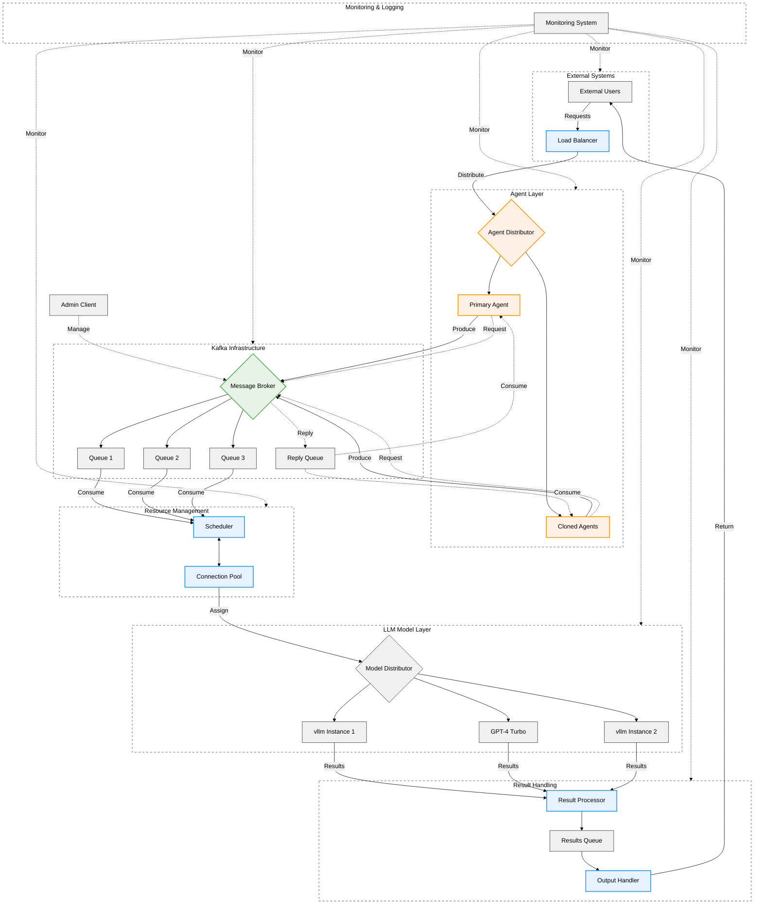
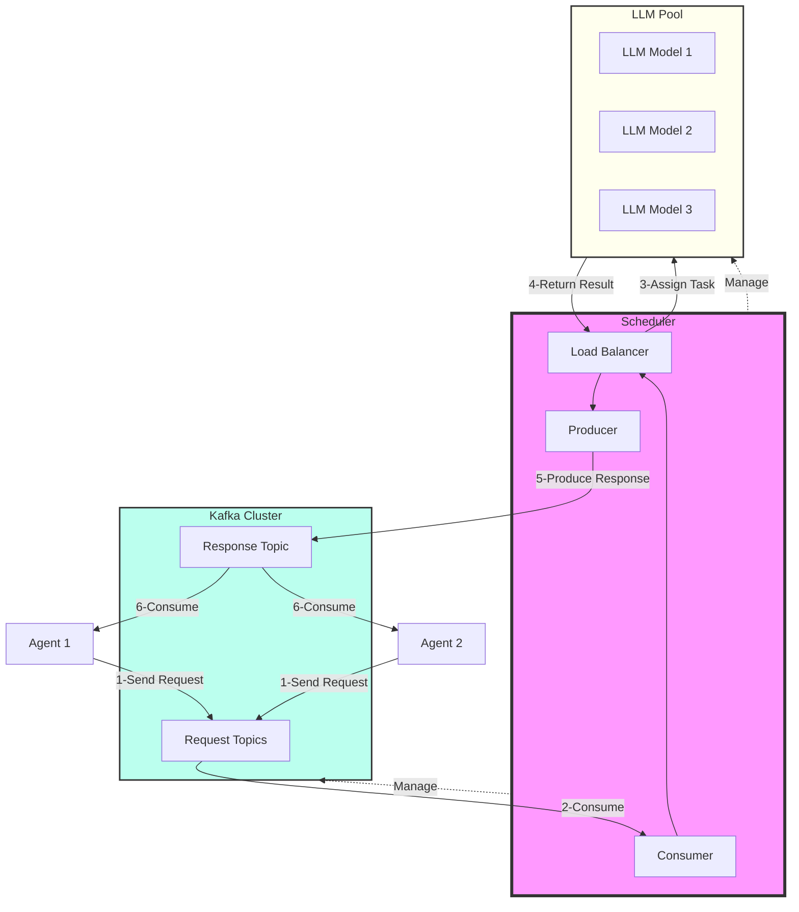
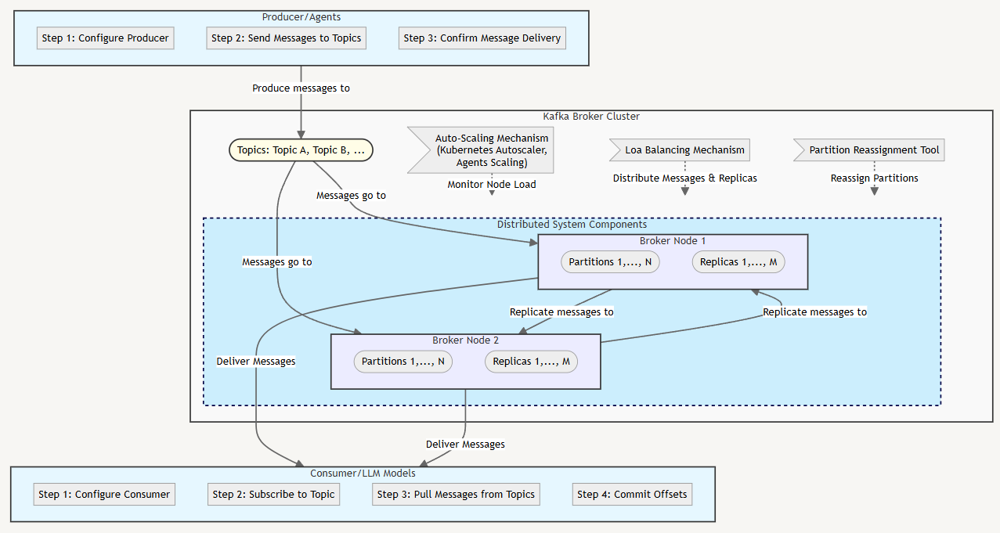

# AgentSched

AgentSched is a high-performance scheduler designed for LLM-based agents, optimizing message routing through load balancing, connection pooling, and dynamic scaling to improve concurrent processing and efficient communication with Large Language Models (LLMs).

## Main Features

- **Intelligent Load Balancing**: Efficiently distribute workload across multiple agents and LLMs.
- **Optimized Connection Pooling**: Manage and reuse connections to maximize resource utilization.
- **Dynamic Scaling**: Automatically adjust resources based on demand.
- **High Concurrency Support**: Handle multiple agent requests simultaneously.
- **Efficient Message Routing**: Ensure messages are delivered to the appropriate LLM quickly and reliably.
- **LLM Integration Optimization**: Streamline the process of communicating with various LLM providers.

## Architecture

Our system architecture leverages Kafka for robust message handling and Kubernetes for scalable deployments:





<p align="center">
  <picture>
    <source media="(prefers-color-scheme: dark)" srcset="docs/assets/readme/main_architecture.png">
    
  </picture>
</p>

## Installation
1. Clone the repository:

```bash
git clone https://github.com/yourusername/agentsched.git
cd agentsched
```

2. Install the required dependencies:

```bash
poetry shell
poetry install
```

## Configuration
Update the following variables in the project as needed:

```
BOOTSTRAP_SERVERS: Kafka bootstrap servers
INPUT_TOPICS: List of input topics for different priorities
OUTPUT_TOPIC: Topic for output messages
SGLANG_BASE_URL: Base URL for the SGLang server
LLM_API_KEY: API key for LLM access (if required)
```

## Quick Start

```python
import random
import time
from threading import Thread
from typing import Dict, List
from uuid import uuid4

from confluent_kafka import KafkaException  # type: ignore[import]
from confluent_kafka.admin import AdminClient, NewTopic  # type: ignore[import]

from agentsched.kafka_server.consumer import Consumer
from agentsched.kafka_server.producer import Producer
from agentsched.load_balancing.scheduler import Scheduler, SchedulerConfig
from agentsched.types import Message, Priority, TaskType

# Kafka configuration
BOOTSTRAP_SERVERS = "localhost:9092"
INPUT_TOPICS = ["high_priority", "medium_priority", "low_priority"]
OUTPUT_TOPIC = "results"
SGLANG_BASE_URL = "http://127.0.0.1:30000/v1"
LLM_API_KEY = "EMPTY"

# Global dictionary to store pending requests
pending_requests: Dict[str, Message] = {}


def create_topics(
    bootstrap_servers: str,
    topics: List[str],
    num_partitions: int = 1,
    replication_factor: int = 1,
):
    """Create Kafka topics if they don't exist."""
    admin_client = AdminClient({"bootstrap.servers": bootstrap_servers})

    new_topics = [
        NewTopic(
            topic,
            num_partitions=num_partitions,
            replication_factor=replication_factor,
        )
        for topic in topics
    ]
    fs = admin_client.create_topics(new_topics)

    for topic, f in fs.items():
        try:
            f.result()  # the result itself is None
            print(f"Topic {topic} created")
        except KafkaException as e:
            if "already exists" in str(e):
                print(f"Topic {topic} already exists")
            else:
                raise KafkaException(f"Failed to create topic {topic}: {e}") from e


def simulate_input_messages(producer: Producer, num_messages: int = 5):
    """Simulate input messages to the system."""

    prompts = [
        "Summarize the main points of climate change.",
        "Explain the concept of artificial intelligence.",
        "Describe the process of photosynthesis.",
        "What are the key features of a democratic government?",
        "How does the internet work?",
    ]

    for _ in range(num_messages):
        correlation_id = str(uuid4())

        message = Message(
            id=f"task_{random.randint(1000, 9999)}",
            task_type=random.choice(list(TaskType)).value,
            priority=random.choice(list(Priority)).value,
            content=random.choice(prompts),
            token_count=random.randint(10, 200),
            correlation_id=correlation_id,
        )
        topic = f"{message.priority}_priority"
        headers = {"correlation_id": correlation_id}
        producer.produce(value=message.model_dump(), topic=topic, headers=headers)
        print(f"[Demo] Produced message: {message}")

        # Store the pending request
        pending_requests[correlation_id] = message

        time.sleep(0.5)  # simulate some delay between messages


def send_response_to_agent(message: Message):
    """Handle the response received for a produced message."""
    correlation_id = message.correlation_id
    if correlation_id in pending_requests:
        original_request = pending_requests.pop(correlation_id)
        print(f"Original content: {original_request.content}")
        print(f"Response: {message.content}")
    else:
        print(f"Received response for unknown correlation ID: {correlation_id}")


def process_output(consumer: Consumer):
    """Process output messages from the system."""
    while True:
        try:
            message = consumer.consume(timeout=1.0)
            if message:
                print("\n[Demo] Received output message:")
                print(f"received message for correlation ID: {message.correlation_id}")
                print(f"Task ID: {message.id}")
                print(f"Model: {message.model_id}")
                print(f"Status: {message.status}")
                print(f"Content: {message.content}")

                # Handle the response
                send_response_to_agent(message)
                print("-" * 50)
        except KafkaException as e:
            print(f"Error processing output: {e}")
            time.sleep(1)  # wait a bit before retrying
```
``` ~~Python~~
def main():
    """Main function to run the system demo."""
    # Create Kafka topics
    create_topics(BOOTSTRAP_SERVERS, INPUT_TOPICS + [OUTPUT_TOPIC])

    # Initialize components
    input_producer = Producer(
        bootstrap_servers=BOOTSTRAP_SERVERS,
    )
    output_consumer = Consumer(
        bootstrap_servers=BOOTSTRAP_SERVERS,
        group_id="output-consumer-group",
        auto_offset_reset="latest",
    )
    output_consumer.subscribe(["results"])

    scheduler = Scheduler(
        SchedulerConfig(
            bootstrap_servers=BOOTSTRAP_SERVERS,
            input_topics=INPUT_TOPICS,
            output_topic=OUTPUT_TOPIC,
            max_workers=10,
        )
    )

    # Add LLM models
    scheduler.add_llm_model(
        "gpt-3.5",
        capacity=5,
        supported_tasks=[
            TaskType.TEXT_GENERATION,
            TaskType.DATA_PROCESSING,
        ],
        base_url=SGLANG_BASE_URL,
        api_key=LLM_API_KEY,
    )
    scheduler.add_llm_model(
        "gpt-4-turbo",
        capacity=3,
        supported_tasks=[
            TaskType.TEXT_GENERATION,
            TaskType.IMAGE_ANALYSIS,
            TaskType.DATA_PROCESSING,
        ],
        base_url=SGLANG_BASE_URL,
        api_key=LLM_API_KEY,
    )
    scheduler.add_llm_model(
        "gpt-4-o",
        capacity=10,
        supported_tasks=[
            TaskType.TEXT_GENERATION,
        ],
        base_url=SGLANG_BASE_URL,
        api_key=LLM_API_KEY,
    )

    # Start threads
    input_thread = Thread(target=simulate_input_messages, args=(input_producer,))
    output_thread = Thread(target=process_output, args=(output_consumer,))
    scheduler_thread = Thread(target=scheduler.run)

    input_thread.start()
    output_thread.start()
    scheduler_thread.start()

    # Wait for input simulation to complete
    input_thread.join()

    # Allow some time for processing
    time.sleep(15)

    # Print any remaining pending requests
    if pending_requests:
        print("Requests without responses:")
        for corr_id, request in pending_requests.items():
            print(f"  Correlation ID: {corr_id}, Request ID: {request.id}")

    # Print model stats
    print("\nModel Stats:")
    for model_id, stats in scheduler.get_model_stats().items():
        print(f"Model {model_id}:")
        print(f"  Current load: {stats.current_load}")
        print(f"  Total processed tasks: {stats.total_processed_tasks}")
        print(f"  Average processing time: {stats.average_processing_time:.2f} s")

    # Cleanup
    scheduler.close()
    input_producer.close()
    output_consumer.close()

    print("Demo completed.")


if __name__ == "__main__":
    main()

```

## Configuration

AgentSched uses a YAML configuration file. Here's a sample configuration:

```yaml
kafka:
  bootstrap_servers:
    - "localhost:9092"
  topics:
    - "agent_messages"

agents:
  - id: "agent1"
    model: "gpt-3.5-turbo"
  - id: "agent2"
    model: "gpt-4"

scaling:
  min_agents: 2
  max_agents: 10
  scaling_factor: 1.5

load_balancing:
  strategy: "round_robin"

connection_pool:
  max_connections: 100
  timeout: 30
```

For more detailed usage instructions, please refer to our [documentation](link-to-docs).

## Contributing

We welcome contributions! Please see our [Contributing Guide](CONTRIBUTING.md) for more details.

## License

AgentSched is released under the MIT License. See the [LICENSE](LICENSE) file for more details.

## Contact

If you have any questions or feedback, please open an issue on this GitHub repository.

